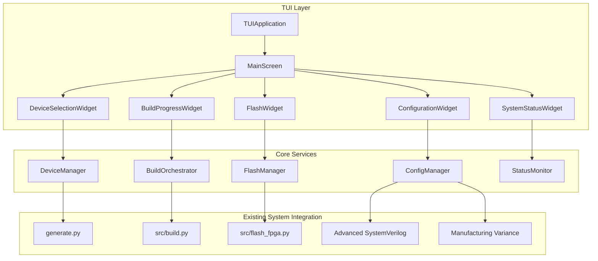
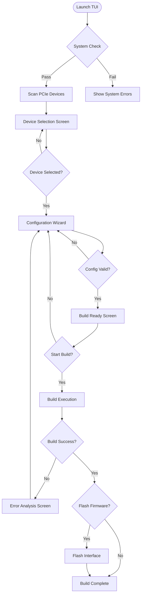
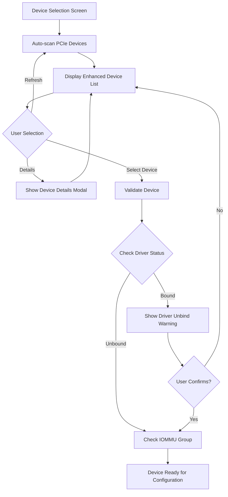

# PCILeech Firmware Generator TUI Architecture Design

**Version:** 1.0  
**Date:** December 2, 2025  
**Target Audience:** Hardware Engineers and FPGA Developers  

## Table of Contents

1. [Executive Summary](#executive-summary)
2. [Current Pain Points Analysis](#current-pain-points-analysis)
3. [Technology Stack & Justification](#technology-stack--justification)
4. [Overall Architecture](#overall-architecture)
5. [User Interface Design](#user-interface-design)
6. [Component Architecture](#component-architecture)
7. [User Flow Design](#user-flow-design)
8. [Integration Strategy](#integration-strategy)
9. [Error Handling & User Guidance](#error-handling--user-guidance)
10. [Implementation Plan](#implementation-plan)
11. [Technical Specifications](#technical-specifications)
12. [Future Enhancements](#future-enhancements)

## Executive Summary

This document outlines the comprehensive architecture for a Text User Interface (TUI) that will enhance the PCILeech firmware generation workflow. The TUI addresses critical pain points in device identification, configuration complexity, build monitoring, and error recovery while maintaining all existing functionality.

**Key Design Principles:**
- **Efficiency-focused**: Streamlined workflows for hardware engineers
- **Actionable information**: Focus on completion percentage, resource utilization, and actionable warnings/errors
- **Seamless integration**: Wrapper architecture around existing [`generate.py`](../generate.py) and [`build.py`](../src/build.py)
- **Progressive disclosure**: Simple configuration save/load with room for future enhancement

## Current Pain Points Analysis

### 1. Device Identification Challenges
- **Problem**: Cryptic lspci output requires manual interpretation
- **Solution**: Enhanced device browser with vendor names, driver status, and IOMMU information

### 2. Configuration Complexity
- **Problem**: 15+ command-line arguments for advanced SystemVerilog features
- **Solution**: Intuitive configuration wizard with logical grouping and validation

### 3. Build Monitoring Limitations
- **Problem**: Long build times (5-20 minutes) with minimal feedback
- **Solution**: Real-time progress tracking with stage completion, resource usage, and error detection

### 4. Multi-step Process Friction
- **Problem**: Separate commands for device binding, building, and flashing
- **Solution**: Unified workflow with guided navigation and state management

### 5. Error Recovery Guidance
- **Problem**: Generic error messages without actionable guidance
- **Solution**: Intelligent error analysis with suggested remediation steps

## Technology Stack & Justification

### Primary Framework: Textual + Rich

**Textual Framework Benefits:**
- **Modern Architecture**: Reactive, widget-based design familiar to hardware engineers
- **Rich Integration**: Built-in syntax highlighting, progress bars, and advanced formatting
- **Performance**: Efficient rendering for real-time monitoring applications
- **Cross-platform**: Consistent behavior across Linux distributions
- **Async Support**: Non-blocking operations essential for build monitoring

**Supporting Libraries:**
```python
# Core dependencies
textual>=0.45.0      # Modern TUI framework
rich>=13.0.0         # Advanced text rendering and formatting
pydantic>=2.0.0      # Configuration validation and serialization
asyncio              # Non-blocking operations (built-in)
watchdog>=3.0.0      # File system monitoring for logs

# Integration dependencies
subprocess           # Interface with existing shell commands
pathlib              # Modern path handling
json                 # Configuration persistence
```

**Justification for Hardware Engineers:**
- **Familiar Concepts**: Widget hierarchy similar to GUI frameworks (Qt, Tkinter)
- **Rich Debugging**: Built-in developer tools and comprehensive logging
- **Extensibility**: Easy to add custom widgets for specialized monitoring needs
- **Performance**: Real-time updates without blocking the main thread

## Overall Architecture

### System Architecture Diagram



### Core Design Patterns

**1. Wrapper Architecture**
- TUI components wrap existing functionality without modification
- Maintains backward compatibility with command-line interface
- Enables gradual migration and testing

**2. Event-Driven Updates**
- Real-time device scanning and status monitoring
- Non-blocking build progress tracking
- Reactive UI updates based on system state changes

**3. Configuration Bridge Pattern**
- Seamless translation between TUI configuration and CLI arguments
- Validation at the TUI level before passing to existing systems
- Profile persistence for repeated workflows

## User Interface Design

### Main Screen Layout

```
┌─ PCILeech Firmware Generator ─────────────────────────────────────────────────┐
│ [Device] [Config] [Build] [Flash] [Status]                          [Help] [⚙] │
├───────────────────────────────────────────────────────────────────────────────┤
│                                                                               │
│  ┌─ Device Selection ──────────────┐  ┌─ Configuration ─────────────────────┐ │
│  │ 📡 PCIe Devices Found: 12       │  │ Board Type: [75t ▼]                │ │
│  │                                 │  │ Device Type: [network ▼]           │ │
│  │ ● 0000:03:00.0 Intel 82574L    │  │ ☑ Advanced SystemVerilog           │ │
│  │   Ethernet Controller           │  │ ☑ Manufacturing Variance           │ │
│  │   Driver: e1000e               │  │ ☑ Behavior Profiling               │ │
│  │   IOMMU: Group 15              │  │                                     │ │
│  │                                 │  │ Profile Duration: [30s]            │ │
│  │ ○ 0000:04:00.0 Realtek RTL8111 │  │                                     │ │
│  │   Ethernet Controller           │  │ Power Mgmt:     [Enabled ▼]       │ │
│  │   Driver: r8169                │  │ Error Handling: [Enabled ▼]       │ │
│  │   IOMMU: Group 16              │  │ Perf Counters:  [Enabled ▼]       │ │
│  │                                 │  │                                     │ │
│  │ [Refresh] [Details]             │  │ [Save Config] [Load Config]        │ │
│  └─────────────────────────────────┘  └─────────────────────────────────────┘ │
│                                                                               │
│  ┌─ Build Progress ────────────────────────────────────────────────────────┐  │
│  │ Status: Ready to Build                                                  │  │
│  │                                                                         │  │
│  │ ┌─ Stages ──────────────────────────────────────────────────────────┐   │  │
│  │ │ ✓ Environment Validation    │ ○ SystemVerilog Generation         │   │  │
│  │ │ ○ Device Analysis          │ ○ Vivado Synthesis                 │   │  │
│  │ │ ○ Register Extraction      │ ○ Bitstream Generation             │   │  │
│  │ └───────────────────────────────────────────────────────────────────┘   │  │
│  │                                                                         │  │
│  │ Current: Waiting for user input                                         │  │
│  │ Progress: ████████████████████████████████████████ 0% (0/6 stages)     │  │
│  │ Resources: CPU: 0% | Memory: 2.1GB | Disk: 45.2GB free                 │  │
│  │                                                                         │  │
│  │ [▶ Start Build] [⏸ Pause] [⏹ Stop] [📋 View Logs]                      │  │
│  └─────────────────────────────────────────────────────────────────────────┘  │
│                                                                               │
│  ┌─ System Status ─────────────────┐  ┌─ Quick Actions ───────────────────┐  │
│  │ 🐳 Podman: Ready               │  │ [🔍 Scan Devices]                 │  │
│  │ ⚡ Vivado: 2022.2 Detected     │  │ [📁 Open Output Dir]              │  │
│  │ 🔌 USB Devices: 3 Found        │  │ [📊 View Last Build Report]       │  │
│  │ 💾 Disk Space: 45.2 GB Free    │  │ [⚙️ Advanced Settings]            │  │
│  │ 🔒 Root Access: Available      │  │ [📖 Documentation]                │  │
│  └─────────────────────────────────┘  └─────────────────────────────────────┘  │
│                                                                               │
├───────────────────────────────────────────────────────────────────────────────┤
│ Ready │ Last build: firmware_intel_82574l_20250602_042530.bin │ 🟢 All systems │
└───────────────────────────────────────────────────────────────────────────────┘
```

## Component Architecture

### Data Models

```python
@dataclass
class PCIDevice:
    """Enhanced PCIe device information"""
    bdf: str
    vendor_id: str
    device_id: str
    vendor_name: str
    device_name: str
    device_class: str
    subsystem_vendor: str
    subsystem_device: str
    driver: Optional[str]
    iommu_group: str
    power_state: str
    link_speed: str
    bars: List[Dict[str, Any]]
    suitability_score: float
    compatibility_issues: List[str]

@dataclass
class BuildConfiguration:
    """Comprehensive build configuration"""
    board_type: str = "75t"
    device_type: str = "generic"
    advanced_sv: bool = True
    enable_variance: bool = True
    behavior_profiling: bool = False
    profile_duration: float = 30.0
    power_management: bool = True
    error_handling: bool = True
    performance_counters: bool = True
    flash_after_build: bool = False

@dataclass
class BuildProgress:
    """Build progress tracking"""
    stage: str
    completion_percent: float
    current_operation: str
    estimated_remaining: Optional[float]
    resource_usage: Dict[str, float]
    warnings: List[str]
    errors: List[str]
```

### Core Service Classes

```python
class DeviceManager:
    """Manages PCIe device discovery and validation"""
    
    async def scan_devices(self) -> List[PCIDevice]:
        """Enhanced device scanning with detailed information"""
        raw_devices = list_pci_devices()  # From existing generate.py
        return [await self._enhance_device_info(d) for d in raw_devices]

class BuildOrchestrator:
    """Orchestrates the build process with real-time monitoring"""
    
    async def start_build(self, device: PCIDevice, config: BuildConfiguration):
        """Start build with progress monitoring"""
        # Integrates with existing build.py workflow
        pass

class ConfigManager:
    """Manages build configuration and profiles"""
    
    def save_profile(self, name: str, config: BuildConfiguration):
        """Save configuration profile to ~/.pcileech/profiles/"""
        pass
        
    def load_profile(self, name: str) -> BuildConfiguration:
        """Load configuration profile"""
        pass
```

## User Flow Design

### Main Workflow



### Device Selection Flow



## Integration Strategy

### Wrapper Architecture Implementation

```python
# tui/main.py - New TUI entry point
from textual.app import App
from .screens.main_screen import MainScreen
from .core.device_manager import DeviceManager
from .core.build_orchestrator import BuildOrchestrator

class PCILeechTUI(App):
    def __init__(self):
        super().__init__()
        self.device_manager = DeviceManager()
        self.build_orchestrator = BuildOrchestrator()
        
    def on_mount(self):
        self.push_screen(MainScreen())

# Integration with existing generate.py
class DeviceManager:
    def scan_pci_devices(self) -> List[PCIDevice]:
        """Wrapper around existing list_pci_devices()"""
        raw_devices = list_pci_devices()  # From generate.py
        return [self._enhance_device_info(d) for d in raw_devices]
```

### Configuration Bridge

```python
class ConfigurationBridge:
    @staticmethod
    def to_cli_args(config: BuildConfiguration) -> argparse.Namespace:
        """Convert TUI config to CLI arguments for existing code"""
        args = argparse.Namespace()
        args.board = config.board_type
        args.advanced_sv = config.advanced_sv
        args.device_type = config.device_type
        args.enable_variance = config.enable_variance
        # ... map all configuration options
        return args
```

### Build Process Integration

```python
class BuildOrchestrator:
    async def start_build(self, device: PCIDevice, config: BuildConfiguration):
        """Integrate with existing build.py workflow"""
        # Convert TUI config to CLI args
        args = ConfigurationBridge.to_cli_args(config)
        
        # Use existing functions with progress callbacks
        original_driver = get_current_driver(device.bdf)
        
        # Bind to VFIO with progress updates
        await self.update_progress("Binding device to VFIO", 10)
        bind_to_vfio(device.bdf, device.vendor_id, device.device_id, original_driver)
        
        # Run container build with monitoring
        await self.update_progress("Starting container build", 20)
        await self.run_monitored_build(device.bdf, config.board_type, args)
```

## Error Handling & User Guidance

### Error Classification System

```python
class ErrorSeverity(Enum):
    INFO = "info"
    WARNING = "warning"
    ERROR = "error"
    CRITICAL = "critical"

@dataclass
class TUIError:
    severity: ErrorSeverity
    category: str  # "device", "config", "build", "flash", "system"
    message: str
    details: Optional[str]
    suggested_actions: List[str]
    documentation_link: Optional[str]
```

### Guided Error Recovery

```python
class ErrorGuidanceSystem:
    def analyze_error(self, error: Exception, context: str) -> TUIError:
        """Analyze errors and provide actionable guidance"""
        if isinstance(error, subprocess.CalledProcessError):
            if "vfio" in str(error):
                return TUIError(
                    severity=ErrorSeverity.ERROR,
                    category="device",
                    message="VFIO binding failed",
                    details=str(error),
                    suggested_actions=[
                        "Check if IOMMU is enabled in BIOS",
                        "Verify vfio-pci module is loaded",
                        "Ensure device is not in use by another driver"
                    ],
                    documentation_link="https://wiki.archlinux.org/title/PCI_passthrough_via_OVMF"
                )
        # ... handle other error types
```

### Error Display Interface

```
┌─ Build Error: VFIO Binding Failed ────────────────────────────────────────────┐
│                                                                               │
│  ❌ Error: VFIO binding failed                                               │
│                                                                               │
│  Details:                                                                     │
│  └─ echo: write error: Device or resource busy                               │
│                                                                               │
│  Suggested Actions:                                                           │
│  1. ☐ Check if IOMMU is enabled in BIOS                                      │
│  2. ☐ Verify vfio-pci module is loaded: lsmod | grep vfio                    │
│  3. ☐ Ensure device is not in use by another driver                          │
│  4. ☐ Try unbinding the current driver first                                 │
│                                                                               │
│  [🔧 Auto-Fix] [📖 Documentation] [🔄 Retry] [❌ Cancel]                     │
└───────────────────────────────────────────────────────────────────────────────┘
```

## Implementation Plan

### Phase 1: Core Infrastructure (Weeks 1-2)
**Deliverables:**
- Basic Textual application framework
- Device scanning and display
- System status monitoring
- Configuration interface foundation

**Key Components:**
- `tui/main.py` - Main application entry point
- `tui/screens/main_screen.py` - Primary interface
- `tui/widgets/device_selection.py` - Device browser
- `tui/core/device_manager.py` - Device management service

### Phase 2: Build Integration (Weeks 3-4)
**Deliverables:**
- Integration with existing [`build.py`](../src/build.py) workflow
- Real-time progress monitoring
- Log parsing and error detection
- Resource usage monitoring

**Key Components:**
- `tui/core/build_orchestrator.py` - Build process management
- `tui/widgets/build_progress.py` - Progress monitoring interface
- `tui/core/log_monitor.py` - Log parsing and analysis
- `tui/core/resource_monitor.py` - System resource tracking

### Phase 3: Enhanced Features (Weeks 5-6)
**Deliverables:**
- USB device selection and flashing
- Configuration save/load functionality
- Advanced error guidance system
- Performance optimizations

**Key Components:**
- `tui/widgets/flash_interface.py` - USB flashing interface
- `tui/core/config_manager.py` - Configuration persistence
- `tui/core/error_guidance.py` - Error analysis and guidance
- `tui/widgets/error_display.py` - Error presentation interface

### Phase 4: Polish & Testing (Weeks 7-8)
**Deliverables:**
- User experience refinements
- Comprehensive testing suite
- Documentation and examples
- Integration testing with existing test suite

**Key Components:**
- `tests/tui/` - TUI-specific test suite
- `docs/TUI_User_Guide.md` - User documentation
- `examples/tui_demo.py` - Example usage
- Performance profiling and optimization

## Technical Specifications

### File Structure

```
tui/
├── __init__.py
├── main.py                    # Main application entry point
├── screens/
│   ├── __init__.py
│   ├── main_screen.py         # Primary interface screen
│   ├── device_details.py      # Device information modal
│   ├── error_screen.py        # Error display and guidance
│   └── help_screen.py         # Help and documentation
├── widgets/
│   ├── __init__.py
│   ├── device_selection.py    # PCIe device browser
│   ├── configuration.py       # Configuration wizard
│   ├── build_progress.py      # Build monitoring
│   ├── flash_interface.py     # USB flashing interface
│   ├── system_status.py       # System status dashboard
│   └── quick_actions.py       # Quick action buttons
├── core/
│   ├── __init__.py
│   ├── device_manager.py      # Device discovery and management
│   ├── config_manager.py      # Configuration persistence
│   ├── build_orchestrator.py  # Build process orchestration
│   ├── flash_manager.py       # USB flashing management
│   ├── status_monitor.py      # System status monitoring
│   ├── error_guidance.py      # Error analysis and guidance
│   ├── log_monitor.py         # Log parsing and analysis
│   └── resource_monitor.py    # Resource usage tracking
├── models/
│   ├── __init__.py
│   ├── device.py             # PCIDevice data model
│   ├── config.py             # BuildConfiguration data model
│   ├── progress.py           # BuildProgress data model
│   └── error.py              # TUIError data model
├── styles/
│   ├── main.tcss             # Main stylesheet
│   ├── device.tcss           # Device selection styles
│   ├── build.tcss            # Build progress styles
│   └── error.tcss            # Error display styles
└── utils/
    ├── __init__.py
    ├── integration.py        # Integration with existing code
    ├── validation.py         # Configuration validation
    └── formatting.py         # Text formatting utilities
```

### Dependencies

```toml
# pyproject.toml additions
[tool.poetry.dependencies]
textual = "^0.45.0"
rich = "^13.0.0"
pydantic = "^2.0.0"
watchdog = "^3.0.0"
psutil = "^5.9.0"  # For system resource monitoring

[tool.poetry.group.tui.dependencies]
textual-dev = "^1.0.0"  # Development tools
```

### Entry Point

```python
# New entry point: tui_generate.py
#!/usr/bin/env python3
"""
TUI version of PCILeech firmware generator.
Provides an interactive interface for the generate.py workflow.
"""

import sys
from pathlib import Path

# Add project root to path for imports
sys.path.insert(0, str(Path(__file__).parent))

from tui.main import PCILeechTUI

if __name__ == "__main__":
    app = PCILeechTUI()
    app.run()
```

### Configuration Schema

```python
# Configuration file format: ~/.pcileech/profiles/profile_name.json
{
    "name": "Network Card Profile",
    "description": "Standard configuration for network devices",
    "board_type": "75t",
    "device_type": "network",
    "advanced_sv": true,
    "enable_variance": true,
    "behavior_profiling": false,
    "profile_duration": 30.0,
    "power_management": true,
    "error_handling": true,
    "performance_counters": true,
    "flash_after_build": false,
    "created_at": "2025-12-02T04:30:00Z",
    "last_used": "2025-12-02T04:30:00Z"
}
```

## Future Enhancements

### Phase 2 Features (Post-MVP)

**1. Advanced Profile Management**
- Profile templates for common device types
- Profile sharing and import/export
- Version control for configuration changes
- Team collaboration features

**2. Enhanced Monitoring**
- Real-time Vivado log streaming with syntax highlighting
- Performance benchmarking and comparison
- Historical build time tracking
- Resource usage optimization suggestions

**3. Integration Enhancements**
- Plugin system for custom device types
- API for external tool integration
- Remote build server support
- Continuous integration hooks

**4. User Experience Improvements**
- Customizable interface layouts
- Keyboard shortcut customization
- Theme and color scheme options
- Accessibility features

### Scalability Considerations

**1. Performance Optimization**
- Lazy loading for large device lists
- Background device scanning
- Efficient log parsing with streaming
- Memory usage optimization for long builds

**2. Extensibility**
- Plugin architecture for custom widgets
- Event system for third-party integrations
- Configuration schema versioning
- Backward compatibility maintenance

**3. Deployment Options**
- Standalone executable packaging
- Container-based deployment
- Remote TUI access via SSH
- Web-based interface option

## Conclusion

This TUI architecture design provides a comprehensive solution for enhancing the PCILeech firmware generation workflow. The design focuses on:

1. **Efficiency**: Streamlined workflows tailored for hardware engineers
2. **Integration**: Seamless wrapper around existing functionality
3. **Monitoring**: Real-time progress tracking with actionable information
4. **Guidance**: Intelligent error handling and recovery assistance
5. **Scalability**: Extensible architecture for future enhancements

The implementation plan provides a clear path from basic functionality to a fully-featured TUI that significantly improves the user experience while maintaining all existing capabilities.

**Next Steps:**
1. Review and approve this design document
2. Set up development environment with Textual framework
3. Begin Phase 1 implementation with core infrastructure
4. Establish testing framework and CI/CD pipeline
5. Create user feedback collection mechanism for iterative improvement

This design document serves as the foundation for implementing a modern, efficient TUI that will transform the PCILeech firmware generation experience for hardware engineers and FPGA developers.